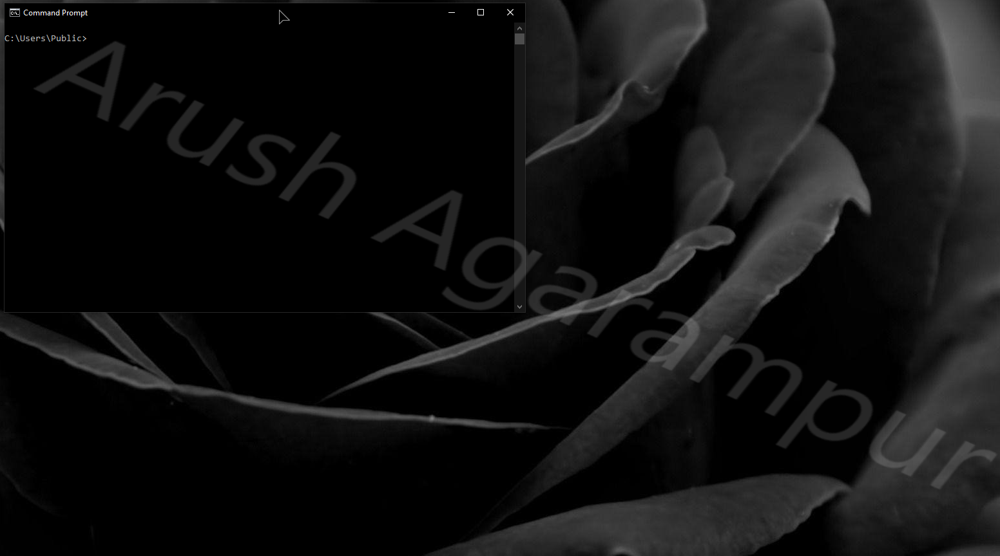
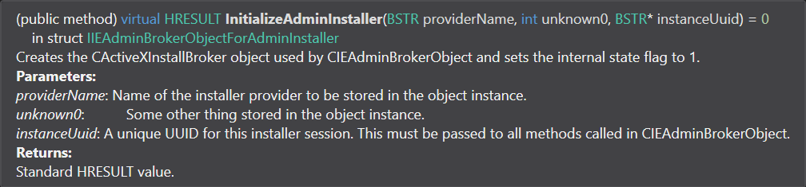

# ByeIntegrity 2.0 — Windows UAC Bypass
The second attack to bypass User Account Control (UAC) and gain elevated (Administrator) privileges to run any program at a high integrity level.

## How it works
Unlike ByeIntegrity 1.0, ByeIntegrity 2.0 uses a completely different attack method — an elevated COM interface. The registry key `HKEY_LOCAL_MACHINE\SOFTWARE\Microsoft\Windows NT\CurrentVersion\UAC\COMAutoApprovalList` contains a list of CLSIDs that tell UAC to not prompt for elevation when creating an interface from any of the listed CLSIDs.

The CLSID `{BDB57FF2-79B9-4205-9447-F5FE85F37312}` represents the Internet Explorer Add-on Installer coclass — this is what ByeIntegrity 2.0 uses for its attack. The coclass allows two interfaces to be created:

 - `IID_IeAxiAdminInstaller`
 - `IID_IeAxiInstaller2`

The various methods called from these interfaces used in this attack eventually end up as their corresponding call in the elevated DCOM server `ieinstal.exe` as these methods:

 - `CIEAdminBrokerObject::InitializeAdminInstaller()`
 - `CIEAdminBrokerObject::VerifyFile()`
 - `CIEAdminBrokerObject::RunSetupCommand()`

ByeIntegrity 2.0 uses these methods to launch `cmd.exe` as a child process of the elevated `ieinstal.exe`; creating an elevated instance of `cmd.exe`, therefore bypassing UAC.

## How was this discovered?
The registry key `COMAutoApprovalList` contains lots of CLSIDs for actions that require elevated permissions but should not prompt because of the current UAC setting (if the setting is lower than the maximum value). I found the Internet Explorer Add-on Installer coclass to be particularly interesting, and while browsing the symbols, I found `CIEAdminBrokerObject::RunSetupCommand()`, which seemed like it would do what I wanted.

I spend lots of time reverse engineering the COM interfaces and the DCOM server to figure out how to use the interfaces and how they behave. Eventually, I figured out that using the three methods listed above allows us to execute an arbitrary program via a call to `CreateProcessW()` from the elevated DCOM server `ieinstal.exe`.

## UACMe
This attack is implemented in UACMe as method #64. Unlike ByeIntegrity 1.0, this attack's code is the same as the code/implementation in UACMe. The only differences are that ByeIntegrity 2.0 uses `cmd.exe` as a lolbin whereas UACMe uses the Fubuki payload,
and ByeIntegrity 2.0 uses `bdeunlock.exe` as the verification file, whereas UACMe uses `consent.exe`.

## Using the code
If you’re reading this then you probably know how to compile the source. Just note that this hasn’t been tested or designed with x86 in mind at all, and it probably won’t work on x86 anyways.

Just like UACMe, **I will never upload compiled binaries to this repo.** There are always people who want the world to crash and burn, and I'm not going to provide an easy route for them to run this on somebody else's computer and cause intentional damage. I also don't want script-kiddies to use this attack without understanding what it does and the damage it can cause.

The undocumented methods/interfaces have been documented using comments. To read the documentation without reading the comment syntax, just hover over them in Visual Studio and read the tooltip that follows.

*Example:*

## Supported versions
This attack works from Windows 7 (7600) up until the latest version of Windows 10.

